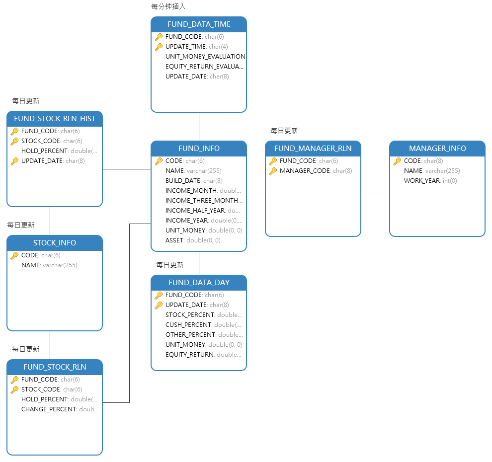

# 基金数据爬虫程序
从天天基金数据接口获取基金数据并保存至本地Mysql

## 数据接口

- http://fund.eastmoney.com/pingzhongdata/{基金代号}.js?v={时间戳}
- http://fundf10.eastmoney.com/FundArchivesDatas.aspx?type=jjcc&code={基金代号}&topline=10&year=&month=

## 数据模型



## 安装配置

* **mysql版本：8.0**

* **python版本：3.6.7**

* 安装python依赖库

  ```shell
  pip3 install -r requirements.txt
  ```

* 使用`fund.sql`初始化数据库

  ```shell
  $mysql -uroot -ppassword
  >create database funddb;
  >use funddb;
  >source fund.sql;
  ```

* 运行main文件

  ```shell
  $python main.py
  ```

  